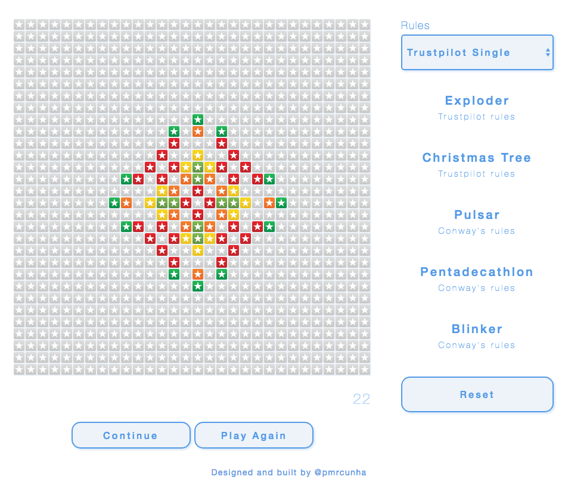

# Conway's Game of Trust
## A Trustpilot flavored version of Conway's Game of Life

In 1970, John Conway created the [Game of Life](https://en.wikipedia.org/wiki/Conway%27s_Game_of_Life). It was an implementation of a celullar automaton and showed that very simple rules can create very complex behaviors. The "game" is a zero-player game, meaning that its evolution is determined by its initial state, requiring no further input. One interacts with the Game of Life by creating an initial configuration and observing how it evolves, or, for advanced "players", by creating patterns with particular properties. I made an adaptation of this using review stars as states. In my version, each cell can have 6 states. Try it out!

### How to use
Just go to http://pmrcunha.github.io/game-of-trust/.

### Build and Run
If you want to build and run the project locally, you can use `yarn build` or `yarn start`, which will build and run the project in one command.

### How to play
##### Single player
Your goal is to get the highest trustscore possible, i.e. as many review stars as possible.

You can place 25 stars in the board, in 25 red stars (1 star review), 5 green stars (5 star review) or any combination in between. You click multiple times to cycle through the possible stars.

When you are satisfied with your pattern, click start.
The game ends after 1000 turns.

At each turn in the game, the following transitions occur:

-   Any review cell with fewer than two neighbor reviews becomes inactive, because no one cares about this company anymore.
-   Any review cell with two or three neighbor reviews is a solid review, and stays the same.
-   Any review cell with more than three neighbors decays one value, because there is always someone complaining when you have a lot of reviews.
-   Any inactive cell with exactly three neighbor reviews becomes a review cell, with the highest rating of the three or, if the three are the same, one value above, as if this review was affected by peer pressure.

##### Multiplayer
In this mode one player places 12 green starts, and the other 12 red stars.
The rules are similar to singleplayer, with the following differences:

-    Any inactive cell with exactly three neighbor reviews becomes a green or a red star, depending on the dominant color of its neighbors
-    Any cell with more than three neighbors becomes inactive

##### Patterns / Sandbox
The sandbox is where you can try out patterns, without input restrictions, and with some examples to see the possibilities.
